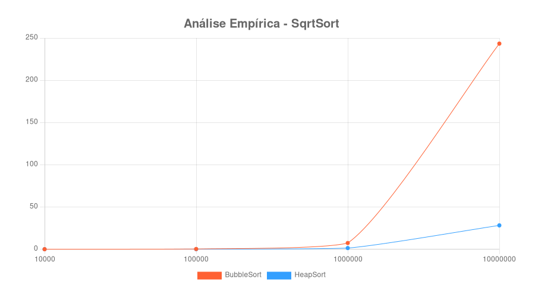

# Análise de Algoritmos - Projeto 1
### Ordenação por Seleção de Raiz Quadrada

Este projeto tem como objetivo principal comparar o tempo de complexidade do algoritmo de ordenação por seleção de raiz quadrada, mais conhecido como "SqrtSort", utilizando um método quadrático de ordenação "BubbleSort" e um método logarítmico através de Heaps.


## Instruções de uso
Para executar o programa, clone o projeto localmente e, no terminal, digite os seguintes comandos:

```
npm install;

node index.js;
```

## Exemplo de gráfico analítico

